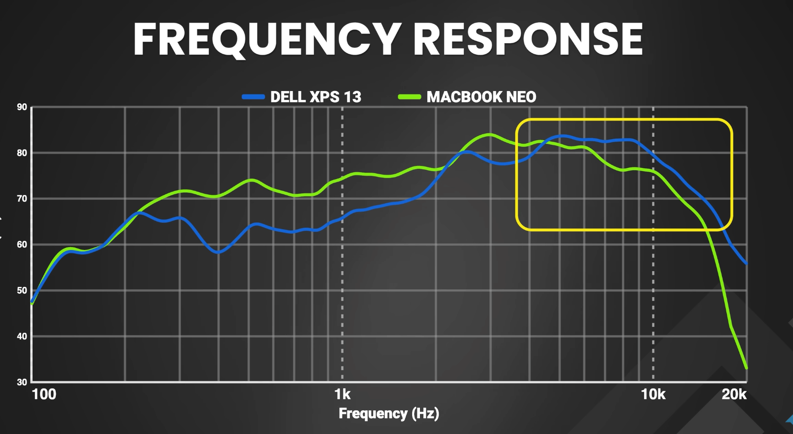
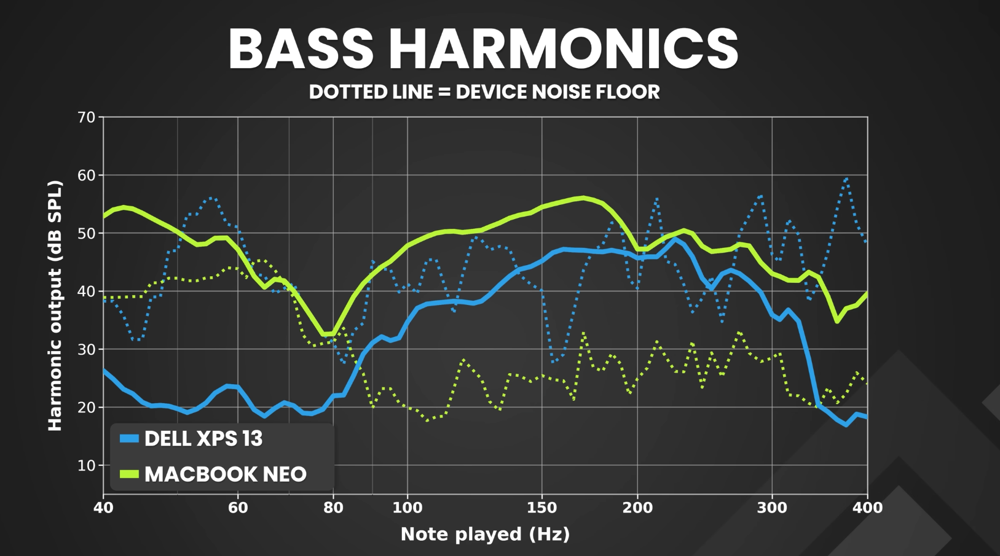

# Audio: tinny/thin internal speakers (CS42L43 codec)

**Status:** Workaround in place (software EQ). Root cause is unfixed at the driver/firmware level. A 2026-08-04 retune attempt was tried and reverted (see below) — current values are still the 2026-08-03 tuning.
**Component:** CS42L43 codec, `sof-soundwire` ALSA sink

## Root cause

The CS42L43 codec's onboard hardware EQ (`cs42l43 EQ Coefficients`, numid=70) ships
all-zero even though `cs42l43 EQ Switch` is on. Dell's real tuning curve was never
loaded — only an inert default is present. No published coefficient set exists yet
for this model. This is **not** a volume/gain issue; turning it up just makes thin
audio louder.

## Retune attempt (2026-08-04), tried and reverted

A third-party frequency-response measurement comparing the XPS 13 against a
reference laptop, plus a bass-harmonics sweep (40-400Hz, plotted against each
device's own noise floor), suggested two changes:





- **300-800Hz shortfall.** The XPS trailed the reference by a fairly flat
  ~8-10dB across that whole range. The old band 2 (200Hz peak, Q=1.1) is too
  narrow to cover it — it was only ever pulling up a spot right around
  200Hz, not the broader gap.
- **6-15kHz reading louder than the reference, not thinner.** The opposite
  of what you'd guess from "tinny" — in this range the XPS actually output
  *more* than the reference laptop, and its rolloff above 15kHz was gentler
  (retained more energy out to 20kHz).

Tried: preamp Mult 0.708→0.631, band 2 shifted/widened to 300Hz/Q0.7/+5dB,
band 3 to −3dB, band 4 to −2.5dB. **By ear, this was muddier than even the
raw unequalized sink** — worse than the problem it was meant to fix. Root
cause: widening band 2's Q from 1.1 to 0.7 roughly doubled its bandwidth,
pulling its effective range down into ~150-250Hz where it stacked with band
1's bass shelf — classic low-mid/"boxy" buildup. The simultaneous deeper cuts
on bands 3-4 compounded it from the other side, removing presence/clarity
energy that would otherwise have balanced out the extra low-mid weight.
**Reverted** — `bass-eq.conf` is back to the 2026-08-03 values (preamp
0.708, band 2: 200Hz/Q1.1/+4dB, band 3: −2dB, band 4: −1.5dB).

Takeaway for next time: a broad, fairly flat gap like the measured
300-800Hz shortfall isn't a good fit for a single wide peaking bell — the
bell shape inherently reaches well below its center frequency at low Q,
so covering the top of a gap this way drags in energy from below it too.
Two narrower, non-overlapping bells (or leaving low-mid alone entirely)
would be the next thing to try, not a single wider one. The bass-harmonics
sweep's finding still stands and needs no revisiting: below ~80Hz the XPS
sits at its own noise floor, so band 1 shouldn't be pushed further — that
part matches the existing conclusion below.

Caveat: the frequency-response graph is a single external comparison of
unknown mic/measurement methodology, not an on-device measurement — treat
its dB deltas as directional, not gospel.

## Fix: PipeWire filter-chain EQ

A PipeWire filter-chain virtual sink EQs the signal before it reaches the real
`sof-soundwire Speaker` ALSA sink.

**Retuned 2026-08-03:** the original curve's 100Hz low-shelf boosted +7dB to
fake bass that the CS35L56 woofer amps weren't actually producing yet (see
[audio/cs35l56-sidecar-amp-quirk.md](cs35l56-sidecar-amp-quirk.md) — at the
time this EQ was written, only the tweeters were routed). Once the woofers
were fixed, that boost doubled up with real low end and, since these
speakers are downward-firing, with surface coupling on a table/lap — result
was muddy bass. Cut the shelf to +2dB; everything else (200Hz warmth peak,
treble-correction bands) is unchanged and still needed to correct for the
zeroed hardware EQ, which is unrelated to the amp-routing fix.

System: PipeWire 1.6.8, WirePlumber 0.5.14 — both support
`libpipewire-module-filter-chain` natively. Fedora ships a ready
`filter-chain.service` systemd `--user` unit (disabled by default; enable it) that
loads `~/.config/pipewire/filter-chain.conf.d/*.conf`.

### `~/.config/pipewire/filter-chain.conf.d/bass-eq.conf`

```
context.modules = [
    { name = libpipewire-module-filter-chain
        args = {
            node.description = "Speaker EQ"
            media.name       = "Speaker EQ"
            filter.graph = {
                nodes = [
                    {
                        type    = builtin
                        name    = preamp
                        label   = linear
                        control = { "Mult" = 0.708 "Add" = 0.0 }
                    }
                    {
                        type    = builtin
                        name    = eq_band_1
                        label   = bq_lowshelf
                        control = { "Freq" = 100.0  "Q" = 0.9 "Gain" = 2.0 }
                    }
                    {
                        type    = builtin
                        name    = eq_band_2
                        label   = bq_peaking
                        control = { "Freq" = 200.0  "Q" = 1.1 "Gain" = 4.0 }
                    }
                    {
                        type    = builtin
                        name    = eq_band_3
                        label   = bq_peaking
                        control = { "Freq" = 3000.0 "Q" = 1.5 "Gain" = -2.0 }
                    }
                    {
                        type    = builtin
                        name    = eq_band_4
                        label   = bq_peaking
                        control = { "Freq" = 6000.0 "Q" = 1.2 "Gain" = -1.5 }
                    }
                    {
                        type    = builtin
                        name    = eq_band_5
                        label   = bq_highshelf
                        control = { "Freq" = 10000.0 "Q" = 0.9 "Gain" = -1.0 }
                    }
                    {
                        type    = builtin
                        name    = safety_clamp
                        label   = clamp
                        control = { "Min" = -0.98 "Max" = 0.98 }
                    }
                ]
                links = [
                    { output = "preamp:Out"      input = "eq_band_1:In" }
                    { output = "eq_band_1:Out"   input = "eq_band_2:In" }
                    { output = "eq_band_2:Out"   input = "eq_band_3:In" }
                    { output = "eq_band_3:Out"   input = "eq_band_4:In" }
                    { output = "eq_band_4:Out"   input = "eq_band_5:In" }
                    { output = "eq_band_5:Out"   input = "safety_clamp:In" }
                ]
            }
            audio.channels = 2
            audio.position = [ FL FR ]
            capture.props = {
                node.name    = "effect_input.bass_eq"
                node.description = "Speaker EQ"
                media.class  = Audio/Sink
            }
            playback.props = {
                node.name    = "effect_output.bass_eq"
                node.passive = true
                target.object = "alsa_output.pci-0000_00_1f.3-platform-sof_sdw.HiFi__Speaker__sink"
            }
        }
    }
]
```

| Stage | Type | Freq | Q | Gain | Purpose |
|---|---|---|---|---|---|
| preamp | linear | — | — | −3 dB | headroom so the boosts below don't clip |
| band 1 | low shelf | 100 Hz | 0.9 | +2 dB | mild bass lift (was +7dB before the woofer amps were fixed) |
| band 2 | peaking | 200 Hz | 1.1 | +4 dB | warmth/body |
| band 3 | peaking | 3 kHz | 1.5 | −2 dB | tame "tinny" resonance |
| band 4 | peaking | 6 kHz | 1.2 | −1.5 dB | reduce harshness |
| band 5 | high shelf | 10 kHz | 0.9 | −1 dB | smooth extreme top end |
| safety clamp | clamp | — | — | ±0.98 | hard limiter so boosts can't digitally clip |

These are the 2026-08-03 values. A 2026-08-04 widen/deepen attempt was
tried and reverted for sounding muddier — see "Retune attempt" above.

### `~/.config/wireplumber/wireplumber.conf.d/51-rename-raw-speaker.conf`

Renames the raw ALSA sink so it's obviously not the one to pick (selecting it
bypasses the EQ):

```
monitor.alsa.rules = [
  {
    matches = [
      { node.name = "alsa_output.pci-0000_00_1f.3-platform-sof_sdw.HiFi__Speaker__sink" }
    ]
    actions = {
      update-props = {
        node.description = "Speakers (raw, unequalized - do not use)"
        priority.session = 100
      }
    }
  }
]
```

## Dead ends investigated (don't retry these)

- **Calf Bass Enhancer (LV2 harmonic exciter)** — installed `lv2-calf-plugins`,
  wired it in, fails to load. Fedora's build of PipeWire's filter-chain module only
  compiles in `builtin`/`ladspa`/`ebur128` plugin loaders; there is no LV2 support
  at all (`/usr/lib64/spa-0.2/filter-graph/` has no lv2 loader).
- **LSP Plugins (LADSPA)** — inspected `lsp-plugins-ladspa.so` directly via
  `strings` (no install needed); no bass-exciter/harmonic plugin exists in it
  either. LSP is mastering/dynamics-focused, not psychoacoustic.
- A real harmonic exciter would need Carla as an LV2 host bridged into PipeWire's
  JACK-compatible graph. Not attempted — heavier setup, extra always-running
  process, for marginal gain.

## Conclusion

Further bass boost beyond this EQ is a hardware/driver limitation (reviews of the
DX13260 independently confirm weak bass) — more digital gain just adds distortion,
not audible bass. Considered closed unless external speakers or the Carla route are
wanted later.

## Known gotcha (not a bug, don't re-diagnose)

KDE's volume OSD/popup shows the "primary" hardware device by default and hides
virtual/filter-chain sinks behind a "show virtual devices" toggle, **regardless of
which sink is actually set as the PipeWire default**. This looks like a
volume-key/loudness mismatch bug but isn't — it's Plasma's OSD defaulting its
visible slider to the raw device. Left as-is rather than trying to hide the raw
sink from Plasma entirely (would require relying on an unconfirmed PipeWire
`media.class` convention).

## For a bug report

- Hardware: Dell XPS 13 DX13260, CS42L43 codec, `alsa-sof-firmware`
- Evidence: `amixer` shows `cs42l43 EQ Coefficients` (numid=70) all-zero while
  `cs42l43 EQ Switch` is on
- Ask: published/loaded Dell tuning coefficient set for this model, or firmware
  update that loads one
